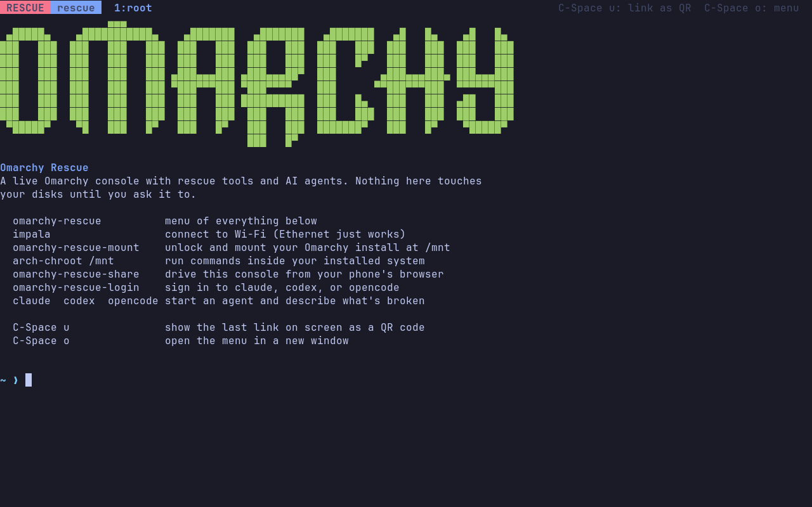
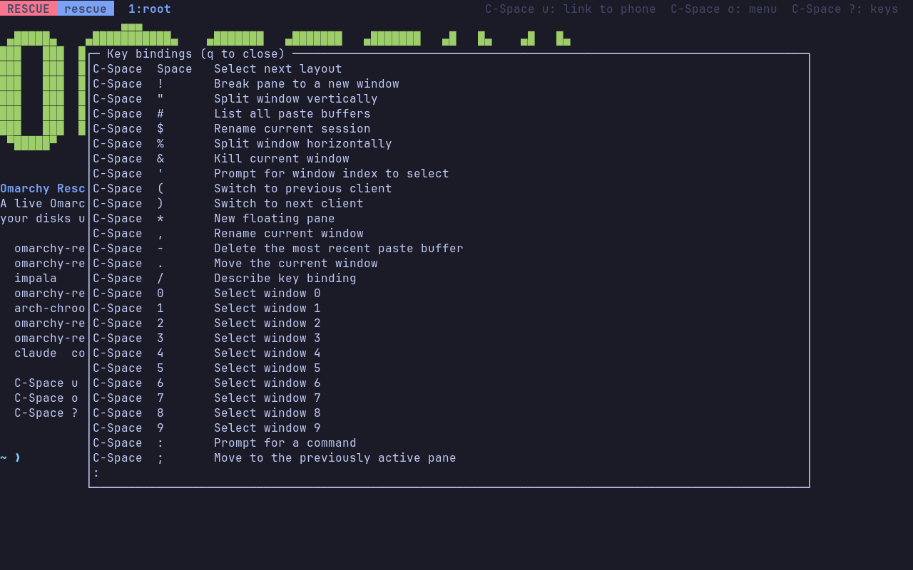
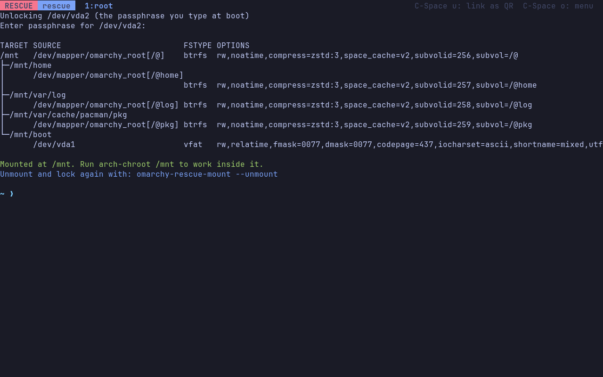
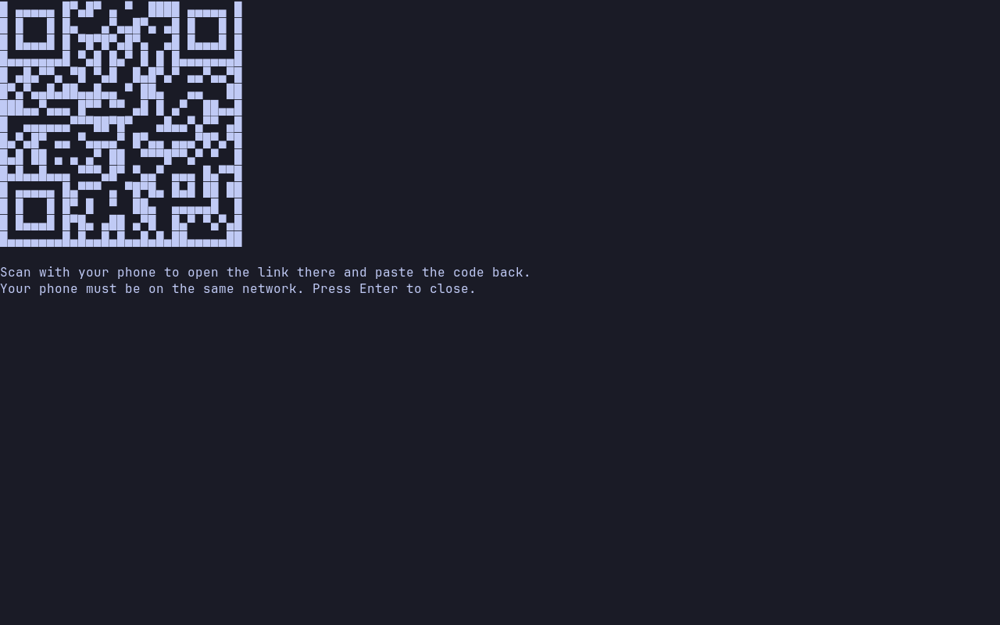
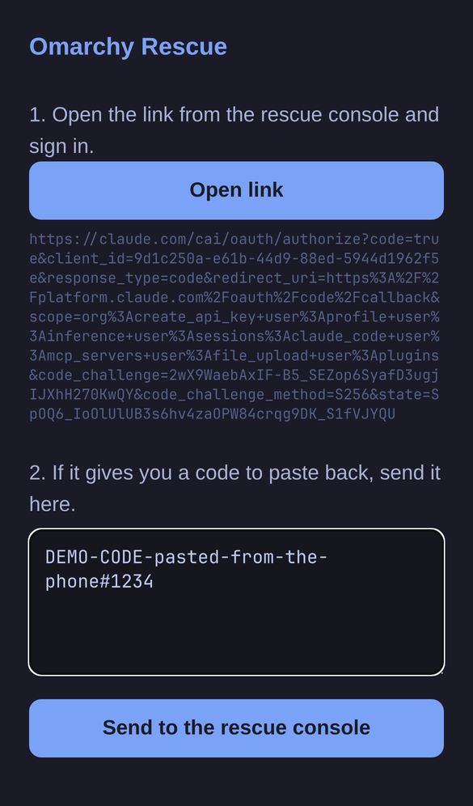
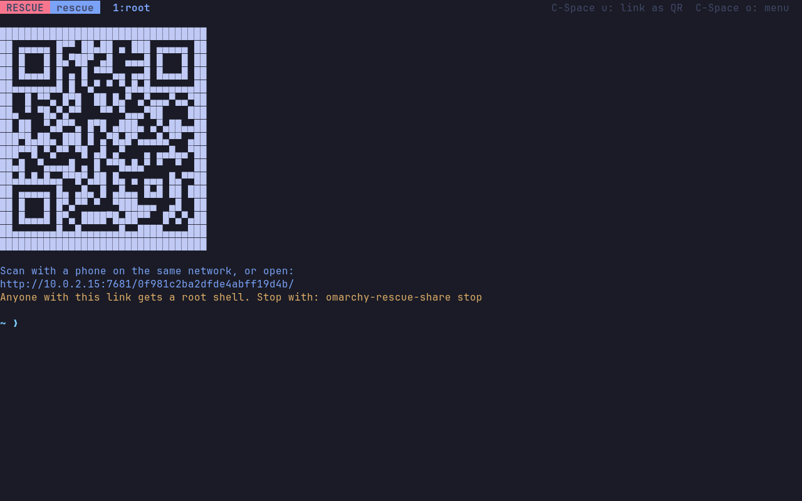
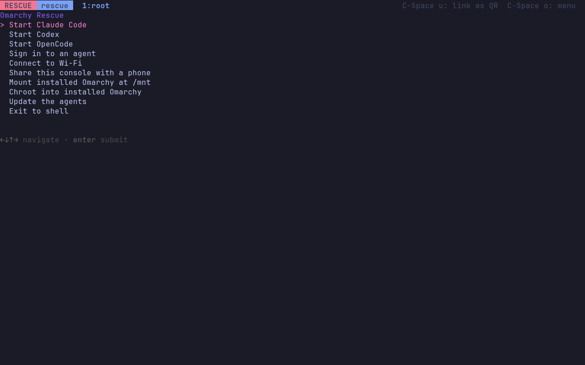

# Omarchy Rescue

A rescue USB for Omarchy: a live Omarchy console with the rescue tools you'd
reach for from SystemRescue, and Claude Code, Codex, and OpenCode ready to help
diagnose and fix a machine that won't boot.

https://github.com/user-attachments/assets/3d764e1b-ad15-4686-975d-beed4420f63f

Music in the film: "Enthusiast" by Tours, [CC BY 3.0](https://creativecommons.org/licenses/by/3.0/).



## Put it on a USB stick

Download the ISO and its `.sha256` from
[Releases](https://github.com/crmne/omarchy-rescue/releases), then write it
with [Caligula](https://github.com/ifd3f/caligula) (`sudo pacman -S caligula`
on Omarchy and Arch):

```bash
caligula burn omarchy-rescue-*.iso -s "$(cut -d' ' -f1 omarchy-rescue-*.iso.sha256)"
```

It checks the download against its checksum, asks which drive to write to, and
erases everything on it.

On **macOS** or **Windows**, check the download first, then write it with
[balenaEtcher](https://etcher.balena.io): pick the ISO, pick the stick, flash.

```bash
shasum -a 256 -c omarchy-rescue-*.iso.sha256                # macOS
certutil -hashfile omarchy-rescue-<version>-x86_64.iso SHA256  # Windows: compare with the .sha256 file
```

On Windows, [Rufus](https://rufus.ie) works too: when it asks how to write the
image, choose DD image mode.

Then boot the broken machine from the stick, usually by picking it in the boot
menu at power-on (F12, F11, or Esc, depending on the machine).

It boots into:

- **Omarchy Rescue** (default): a kmscon console on tty1 with JetBrains Mono,
  truecolor, and the Tokyo Night palette, no desktop needed.
- **Omarchy Rescue, basic console**: the plain kernel console with `nomodeset`,
  for GPUs kmscon can't drive.

It's built from the Omarchy ISO itself, so it boots the same kernel on the same
hardware. It can also be built as the full Omarchy ISO with rescue added in
front of the untouched installer; see [Building](#building).

## Using it

Boot the rescue entry and you land in a tmux session running Omarchy's shell.

```
omarchy-rescue-keyboard change the keyboard layout (it starts as US)
impala                  connect to Wi-Fi (Ethernet just works)
omarchy-rescue-login    sign in to claude, codex, or opencode
omarchy-rescue-mount    unlock and mount your Omarchy install at /mnt
arch-chroot /mnt        run commands inside it
claude                  describe what's broken
omarchy-rescue          a menu of all of the above
```

`omarchy-rescue-keyboard` with no arguments lets you pick a layout from a
list; `omarchy-rescue-keyboard de` (or `fr`, `it`, `gb`, ...) sets one
directly. The console restarts with it and your session carries on.

The prefix key is **C-Space**, as in Omarchy. **C-Space ?** lists every key
binding:



`omarchy-rescue-mount` asks for your disk passphrase and mounts the whole
install the way it mounts itself, from its own fstab:



### Signing in without a browser

Every agent signs in from the terminal by printing a link to open on another
device. `omarchy-rescue-login` hands that link to your phone: as soon as the
agent prints it, a QR code pops up. Scan it and you get a page that opens the
sign-in link. What happens next depends on the agent:

- **Claude Code** wants a long code pasted back. The phone page has a box for
  it: send it, and the code is typed into the console; press Enter there to
  use it.
- **OpenCode** needs nothing pasted: its link carries a short code, and the
  page it opens shows it. The QR screen and the phone page show the same code,
  so you can check they match before you approve. This is the sign-in for an
  OpenCode account (Zen); for another provider's API key, run
  `opencode auth login`.
- **Codex** works the other way round: the console has a one-time code that
  you enter on the page the link opens. It is shown under the QR code and on
  the phone page. Your ChatGPT account has to allow this first: turn on device
  code sign-in for Codex in ChatGPT's security settings, or the sign-in page
  refuses the code.

For those two the QR code closes by itself once the agent is signed in.

The page lives on this machine, on the local network, behind a random
address; it serves one paste and stops. Pasted text never includes a newline,
so nothing runs until you press Enter. **C-Space u** does the same for any
link on screen.

`omarchy-rescue-share` goes further and serves the whole tmux session to your
phone's browser with ttyd. It's a root shell behind a random address, so stop
it with `omarchy-rescue-share stop` when done.

| The QR code pops up by itself | The page it opens on your phone |
| --- | --- |
|  |  |

| `omarchy-rescue-share` | `omarchy-rescue` |
| --- | --- |
|  |  |

### What the agents know

Each agent reads `/usr/share/omarchy-rescue/AGENTS.md` (linked in as
`~/.claude/CLAUDE.md`, `~/.codex/AGENTS.md`, and
`~/.config/opencode/AGENTS.md`). It tells them where they are, how an Omarchy
install is laid out (LUKS, Btrfs subvolumes, Limine, snapper), how to reach its
journal and chroot into it, and to diagnose read-only first and never run
anything destructive without a clear yes.

## Building

```bash
bin/omarchy-rescue-make                   # rescue-only ISO (~1.8GB), stable channel
bin/omarchy-rescue-make --with-installer  # the full Omarchy ISO plus rescue (~6.6GB)
bin/omarchy-rescue-boot                   # boot the newest ISO in QEMU (needs qemu-desktop, edk2-ovmf; with passt, a phone can reach it)
test/boot-smoke.py                        # boot the newest ISO headless and check the console and the agents
```

`--edge` and `--rc` pick the channel. The ISO lands in `release/`.

Both builds clone the pinned `omarchy-iso` submodule into `build/` and apply
the rescue layer with `builder/apply-rescue.sh`, in Docker. The rescue-only
build (`builder/build-rescue-only.sh`) makes the Omarchy ISO's live system
without the installer and its 4.8GB offline package mirror, installing from
the online repos instead. `--with-installer` runs omarchy-iso's own build with
the rescue entries added in front of the installer. Neither mounts the host's
pacman cache into the build, so neither needs sudo to wipe it the way upstream
does.

To release, commit hand-written notes as `packaging/release-notes/vYYYY.MM.DD.md`,
then push a matching `v*` tag. GitHub Actions builds the rescue-only ISO, boots
it with `test/boot-smoke.py`, and publishes it with its checksum and those
notes; without a notes file it stops before building, and an ISO that fails the
smoke test is not published.

To track a newer Omarchy ISO, bump the submodule. `apply-rescue.sh` checks
every edit it makes and fails the build if an upstream change moved one of its
anchors.

A scheduled workflow does that on the 1st and 15th of every month: it moves
`omarchy-iso` to its newest commit, builds the ISO from that day's packages,
and boots it with `test/boot-smoke.py`. If anything fails, the run fails. If it
all passes and `omarchy-iso` moved, it opens a pull request with the update and
the tested ISO attached to the run. Releasing stays manual.

## Layout

```
configs/rescue.packages      packages added to the live environment
configs/airootfs/            files added to the live root
  etc/systemd/system/        kmscon console, fallback getty, online pacman
  etc/profile.d/             lands every rescue login in the shared tmux session
  etc/kmscon/                font and palette
  usr/local/bin/             omarchy-rescue* helpers
  usr/share/omarchy-rescue/  AGENTS.md, tmux.conf, online pacman configs
builder/apply-rescue.sh      layers all of the above onto an omarchy-iso checkout
builder/build-rescue-only.sh builds the rescue-only ISO in the Arch container
```

## How rescue mode works

The rescue entries boot the same kernel and initramfs as the Omarchy installer, adding
`omarchy.rescue=kms` (or `=tty`) and `cow_spacesize=50%` so the live overlay
has room for pacman and agent state. That flag:

- starts kmscon on tty1 in place of the autologin getty, falling back to the
  getty if kmscon fails,
- stops the installer wizard from starting on tty1,
- points pacman at the online repos, so tools can be installed and agents
  updated (`omarchy-rescue update`).

## License

Omarchy Rescue is released under the [MIT License](LICENSE), like Omarchy and
omarchy-iso. The software on the ISO keeps its own licenses.
